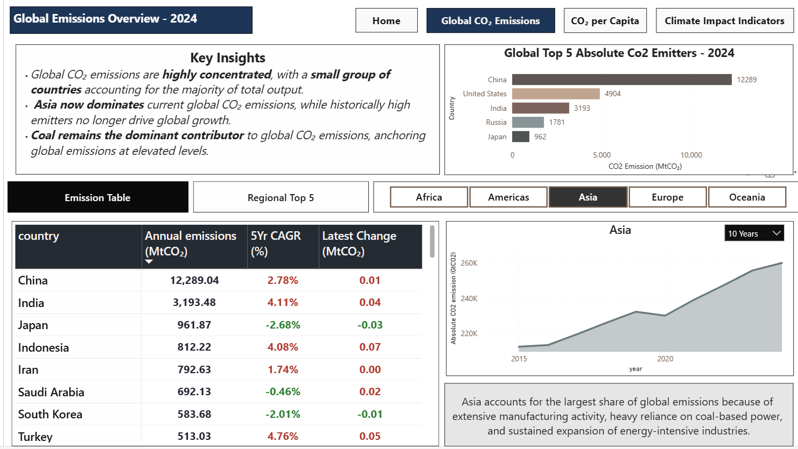
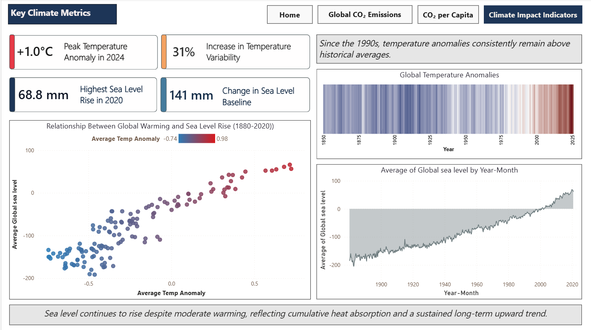

# Global CO₂ Emissions & Climate Indicators Dashboard

## Project Overview

This project presents an interactive Power BI dashboard analyzing global CO₂ emissions alongside key climate indicators. The objective is to explore emission patterns across countries and regions, identify major contributors, and examine how emissions have evolved over time.

The dashboard combines multiple datasets including CO₂ emissions, temperature anomalies, and global mean sea level. Since these indicators originate from different sources with varying update cycles, each visualization reflects the most appropriate data coverage within its respective dataset.

---
## Dashboard Preview

---
## Dashboard Features

### CO₂ Emissions Analysis

This section focuses on analyzing both **total CO₂ emissions** and **per-capita emissions** to understand global emission responsibility and growth patterns.

Key components include:

- **Top 5 Global Emitters** – Highlights the countries contributing the largest share of global CO₂ emissions.

- **Regional Top 5 Emitters** – A continent slicer enables users to dynamically explore the highest emitting countries within each region.

- **Comparative Country Table** – Allows side-by-side comparison of countries using indicators such as total emissions, emissions per capita, 5-Year Compound Annual Growth Rate (CAGR), and recent emission change.

These elements help reveal both **overall global emission patterns** and **regional emission dynamics**, making it easier to identify dominant contributors as well as countries experiencing rapid emission growth.

---

### Emission Trend Analysis

A time-series line chart visualizes emission trajectories across years. A dynamic year slicer allows users to explore historical emission patterns and examine how global emissions have evolved across different time periods.

---

### Climate Indicator Visualization

To provide environmental context alongside emission trends, the dashboard incorporates climate indicators including **temperature anomalies** and **global mean sea level**.

Temperature anomaly trends highlight long term warming patterns and deviations from historical baselines, while sea level data illustrates the progression of global sea level rise. A scatter plot further explores the relationship between these indicators, helping visualize the **correlation between rising global temperatures and increasing sea levels**.

Additional derived metrics such as temperature variability, baseline deviation, peak temperature levels, and maximum sea level rise are used to highlight key observations within the climate indicators.

---

## Technical Highlights

**Custom Visuals:** Integration of Deneb using Vega-Lite specifications to create specialized climate indicator charts that extend beyond standard Power BI visual capabilities.

**DAX Modeling:** Implementation of DAX measures for calculating analytical metrics such as 5-Year CAGR, regional rankings, emission change indicators, temperature variability, peak temperature levels, and maximum sea level rise.

**UI/UX Design:** A multi-page navigation system using bookmarks and buttons, including a home navigation layer for seamless movement between Global, Per-Capita, and Climate Impact views.

---
## Tools Used

**Visualization Tool:** Power BI Desktop  
**Languages / Technologies:** DAX, Vega-Lite (via Deneb)

**Data Sources:**
- CO₂ Emissions Data – Our World in Data (OWID)
- Temperature Anomaly & Sea Level Data – NOAA Climate Data Online (CDO)
